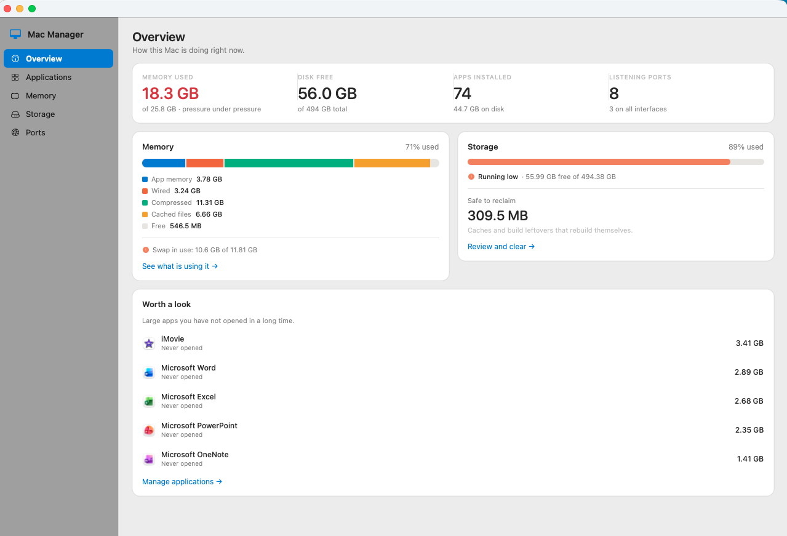
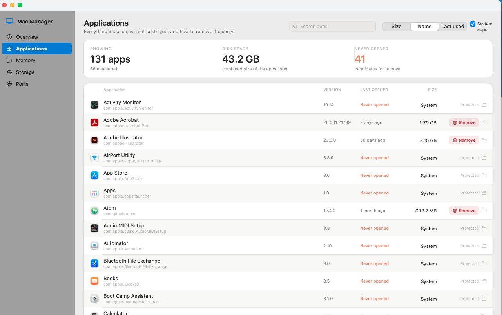
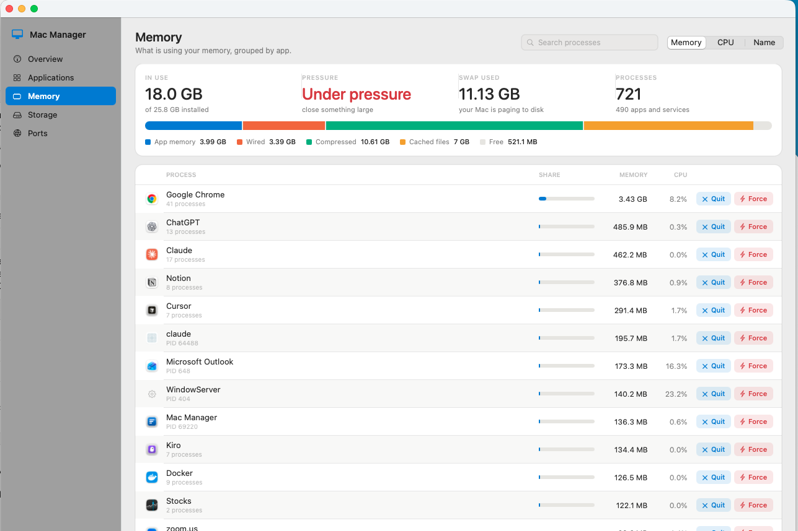
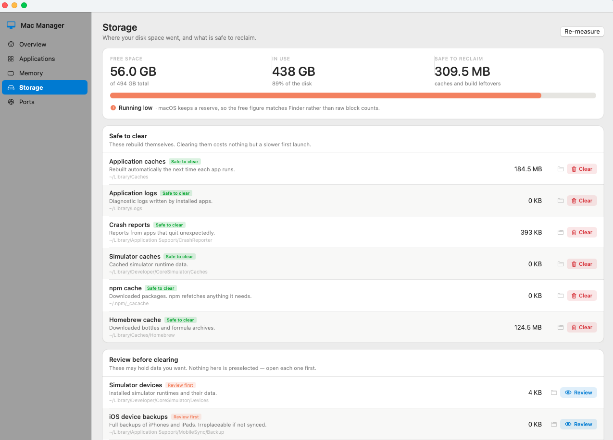
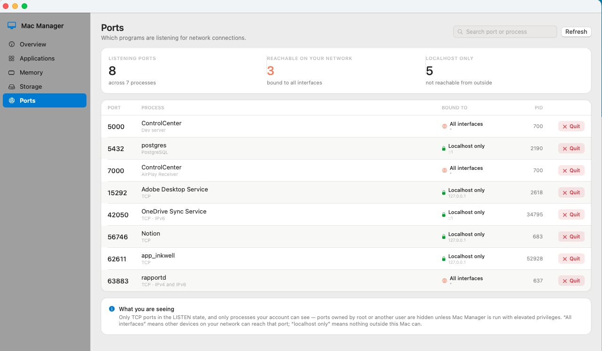

# Mac Manager

A local macOS app for managing what is installed on your Mac, what is using its
memory, where its disk space went, and which ports are open.

Native SwiftUI. No dependencies, no package manager, no network access, no
background agent. It reads the same system tools you would run by hand
(`lsof`, `ps`, `du`, `vm_stat`, `sysctl`, `mdls`) and puts them behind one window.



## Build and run

```bash
./build.sh && open "build/Mac Manager.app"
```

To keep it in your Applications folder:

```bash
cp -R "build/Mac Manager.app" /Applications/
```

Requires the Xcode Command Line Tools (`xcode-select --install`). Nothing else.

## System tabs

**Overview** *(above)* — memory, storage, app count and open ports at a glance,
plus large apps you have not opened in over six months.

### Applications

Everything in `/Applications` and `~/Applications` with its version, size, and
the date you last opened it. Sort by size to find what is costing you, or by last
opened to find what you have forgotten about. Removing an app also finds the
support files it scattered through your Library folders, which a plain
drag-to-Trash leaves behind — often far larger than the app itself.

Apps on the sealed system volume are listed for context and marked *Protected*.



### Memory

A live breakdown of app memory, wired, compressed and cached, with processes
grouped by the app that owns them — so a browser reads as one row instead of
forty. Quit asks nicely; Force Quit does not.



### Storage

Disk capacity, plus the directories that quietly accumulate gigabytes: caches,
logs, Xcode derived data, package-manager downloads. Each is labelled *Safe to
clear* or *Review first*. There is also an on-demand measurement of every
top-level folder in your home directory.



### Explore

Where the missing space actually is. Finder hides `~/Library` and every
dot-folder, which is precisely where large caches accumulate — on the machine
this was built on, **87 of 133 items in the home folder were hidden**.

Explore lists everything: dot-names, hidden-flagged folders, the lot. Sorted
biggest first, with a Hidden badge on anything Finder omits, breadcrumbs to
drill down, and shortcuts straight to Library, Containers, Application Support,
Caches, Developer and the temp folder.

Folders are listed instantly and measured afterwards. A folder's size is not
known until its whole tree has been walked, and `~/Library` can take minutes —
so you get the listing immediately and the sizes fill in as they arrive.

### Ports

Every TCP port in the LISTEN state, which process owns it, and whether it is
reachable from your network or only from this Mac.



## File tabs

### Find

Search your files by meaning as well as by name, and tag them.

Scoring is hybrid on purpose. Meaning alone is not trustworthy on short
filenames — asked for "work slides" a pure embedding search ranked a holiday
photo above an actual presentation — so keyword matching against names, folders,
tags and file kind carries most of the weight, and semantic similarity fills the
gaps a keyword misses. Asking for "spreadsheet budget" surfaces a `.csv` with
neither word in its name.

The embedding model is Apple's, running on this Mac. Nothing is uploaded.

Tags are real macOS Finder tags, written to the `_kMDItemUserTags` extended
attribute — so tags set here appear in Finder's sidebar, and tags set in Finder
appear here.

### Organize

Sorts loose files in a folder into a structure — by type, by type and year, or
by year and month.

Nothing moves until you have seen the complete plan and approved it. Existing
subfolders are left alone, because they usually reflect a structure you already
chose. Nothing is ever overwritten: a name that is already taken gets a numbered
suffix. Every run records where each file came from, so **Undo** puts them all
back and removes the folders it created.

### Backup

Mirrors chosen folders to an external drive using rsync.

- **Never deletes.** `--delete` is not used, so removing a file on your Mac never
  removes it from the backup.
- **Always previewable.** A dry run lists exactly what would be copied first.
- **Versioned.** Replaced files move into a timestamped folder rather than being
  overwritten, so previous versions stay recoverable.
- **Skips build junk.** On the machine this was built on, excluding
  `node_modules` and friends took one folder from **679,767 files to 60,752**,
  and the scan from 44 seconds to 3.
- **Carries tags.** NTFS and exFAT drives cannot store extended attributes, so
  tags would be silently lost on copy. They are written alongside the backup as
  `tags.json` instead.

It is a mirror with history, not a Time Machine replacement — it does not
snapshot your whole system, and a drive that lives next to your Mac is not
protection against fire or theft.

## How removal works

**Nothing is ever deleted. Everything goes to the Trash.**

That is a deliberate trade, and it has one consequence worth stating plainly:
*moving 4 GB of caches to the Trash does not free 4 GB until you empty the Trash.*
The app says so at every point where it matters, and gives you a button to open
the Trash in Finder. It will not empty the Trash for you — that is a permanent
deletion, and it stays your decision.

Before anything moves, you see the exact list of files with their sizes and can
uncheck any of them.

### How leftover files are matched

Conservatively, on purpose:

- **Bundle identifier prefix** in the folders keyed by identifier
  (`~/Library/Containers`, `Caches`, `Preferences`, `HTTPStorages`,
  `Group Containers`, `LaunchAgents`, and the machine-wide equivalents).
- **Exact folder-name match** in the few places keyed by app name
  (`~/Library/Application Support`, `Caches`, `Logs`).

Anything ambiguous is left out rather than guessed at. A missed leftover file
costs a few megabytes; a wrong match costs you data.

## Permissions

- **Administrator password** — only if you remove something owned by root. The
  app hands the move to Finder, which asks you directly. It never runs `sudo`.
- **Automation (Finder)** — same case, prompted once by macOS.
- **Full Disk Access** — optional. Without it a few protected paths report as
  empty. Grant it in System Settings › Privacy & Security if you want those
  measured.

## Known limits

- `lsof` only reports processes your account can see, so ports owned by root or
  another user are not listed. The Ports tab says this on screen.
- System apps in `/System/Applications` are shown for context but marked
  Protected — they are on the sealed system volume and cannot be removed.
- Sizes come from `du`, which measures actual blocks used. Apps sharing files
  through hard links can read smaller than expected.
- The app is signed ad-hoc, not notarised. It is built from source on your own
  machine, so Gatekeeper does not quarantine it.

## Layout

```
Sources/
  MacManagerApp.swift      app shell, sidebar, shared state
  Support/                 shell wrapper, formatters, design system
  Models/                  data types
  Services/                AppScanner, MemoryMonitor, StorageScanner, PortScanner
  Views/                   one file per tab, plus the uninstall sheet
                           (ExploreView is the hidden-file browser)
Tools/MakeIcon.swift       app icon, drawn in code
build.sh                   compile, bundle, sign
```

## License

MIT — see [LICENSE](LICENSE).
